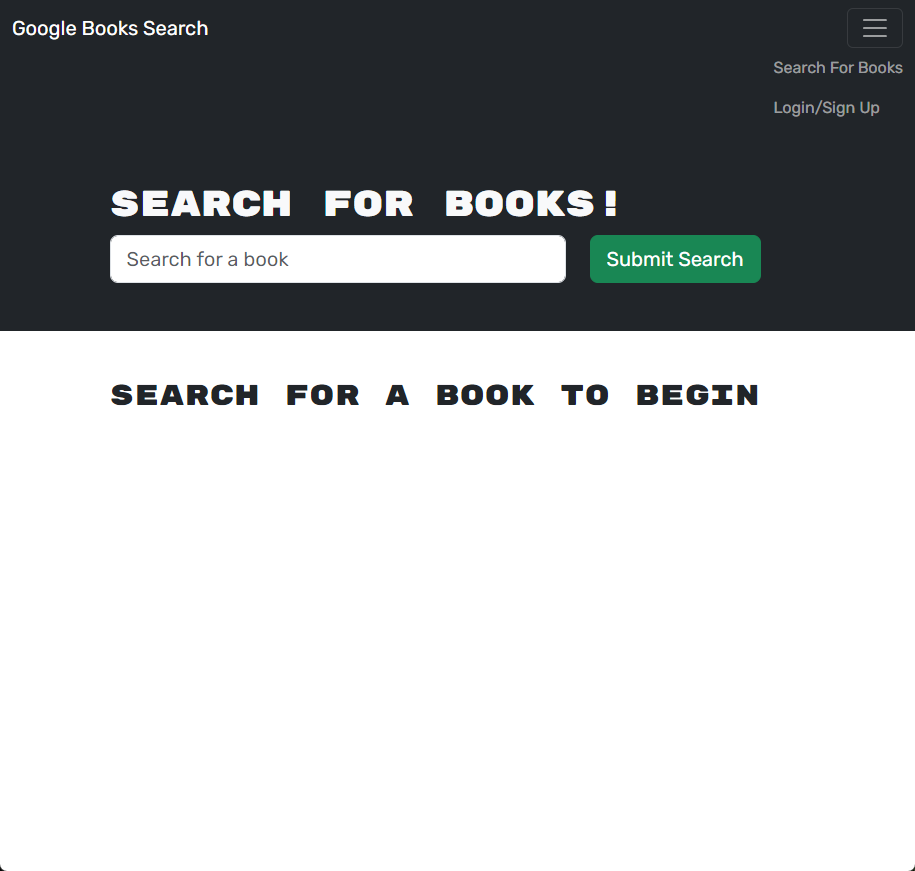
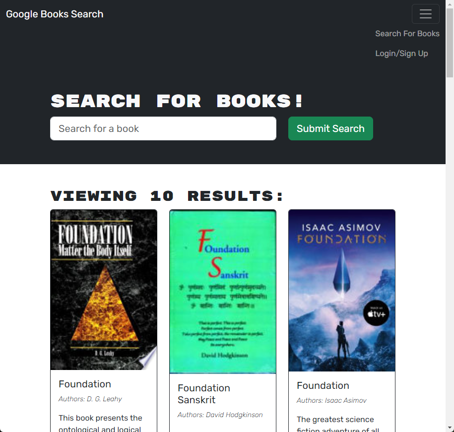
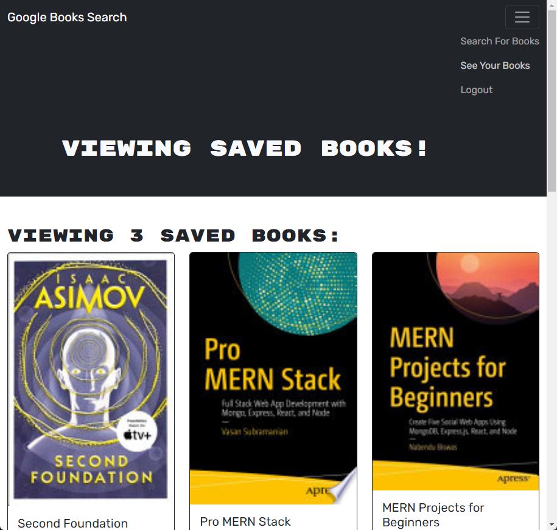

# Lookie-Bookies

 [](https://opensource.org/licenses/MIT)

A MERN stack Google Books API book search engine, built with GraphQL API and Apollo Server.

## Description

This application allows users to create an account, search for books, and save them to a list of books in their account. Users can also view their saved books and delete them from their account. The application is built with a React front end, MongoDB database, and Node.js/Express.js server and API. It uses Google Books API to search for books, and GraphQL API and Apollo Server to query and mutate data. It uses local storage to store JWT authentication tokens and offline data.

## Table of Contents

- [Technologies Used](#technologies-used)
- [Installation](#installation)
- [Usage](#usage)
- [Live Application](#live-application)
- [Credits](#credits)
- [License](#license)
- [Contributing](#contributing)
- [Questions](#questions)

## Technologies Used

- [JavaScript](https://developer.mozilla.org/en-US/docs/Web/JavaScript) - Programming language
- [Node.js](https://nodejs.org/en/) - JavaScript runtime environment
- [Express.js](https://expressjs.com/) - Node.js web server application framework
- [Node.js](https://nodejs.org/en/) - JavaScript runtime environment
- [React](https://reactjs.org/) - JavaScript library for building user interfaces
- [MongoDB](https://www.mongodb.com/) - NoSQL database
- [Mongoose](https://mongoosejs.com/) - MongoDB object modeling for Node.js
- [GraphQL](https://graphql.org/) - Query language for APIs
- [Apollo Server](https://www.apollographql.com/docs/apollo-server/) - GraphQL server
- [Apollo Client](https://www.apollographql.com/docs/react/) - GraphQL client
- [JWT](https://jwt.io/) - JSON Web Tokens for authentication
- [Bcrypt](https://www.npmjs.com/package/bcrypt) - Password hashing
- [Bootstrap](https://getbootstrap.com/) - CSS framework
- [Heroku](https://www.heroku.com/) - Hosting for the live application

## Installation
  
Fork or copy the repository to your own machine. To install the necessary dependencies, run the following command in the terminal:
  
To install dependencies for the client and the server, run the following command in the terminal:

```bash
npm run install
```

To build the application in the development environment, run the following command in the terminal:

```bash
npm run develop
```

To build the application in the production environment, run the following command in the terminal:

```bash
npm run build
```

## Usage

Navigate to [http://localhost:3000](http://localhost:3001) or the [Live Application](#live-application) in your browser to view the application.

Enter a search term in the search bar and click the search button to search for books. Click the "Login/Signup" button to create an account or login to an existing account. Once logged in, and after you run a search, click the "Save this Book!" button on a book you like to save a book to your account. Click the "See Your Books" Nav bar menu item to view your saved books. Click the "Delete this Book!" button to delete a book from your account. Click the "Logout" button to log out of your account.

### Screenshots

Initial screen in browser:


Searching for books (not logged in):


Viewing saved books:


## Live Application

The application is deployed on Heroku [Lookie-Bookies](https://lookie-bookies-a3679a7f8e19.herokuapp.com//).

## Credits

Thanks to the brilliant minds who created the libraries that made this application possible. See the links in the [Technologies Used](#technologies-used) section above.

## License
  
This repository is licensed under the [MIT](https://opensource.org/licenses/MIT) license.
  
## Contributing
  
Contributions to this project will not be accepted, as this project is an assessment piece for a coding course, and it must be the project author's own work. However, feel free to fork the repository and make your own changes.
  
## Questions
  
If you have any questions about the repository, open an issue or contact me directly at:
[rene.malingre@gmail.com](mailto:rene.malingre@gmail.com).
  
You can find more of my work at [GitHub](https://github.com/ReneMalingre).

